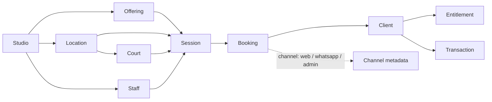

# Dominio Viborea

Viborea es la operación de una academia de pádel: grilla fija + excepciones de la semana, cobro adelantado, sin doble reserva de pista ni de entrenador.

No es alquiler de canchas al público (Playtomic). No es “reservá 30 minutos conmigo” (Calendly). Academia DG (Asunción) es el piloto, no el producto: el schema no nombra a Diego, Paraguay ni DG.

Metáfora: la bandeja (golpe de control). El producto se llama Viborea; el software controla la grilla.

## Conservar de Tandava

- Studio → Locations → Staff → Offerings → Session (`class_occurrence`).
- Session existe aunque nadie reserve ni pague.
- Booking ≠ Transaction. Check-in ≠ pago.
- Entitlement (pack / membresía / cortesía) ≠ Transaction.
- Un solo schedule. El canal es metadata del booking.
- Exports de primera clase.
- Backend detrás de `src/lib/backend/`.
- Demo mode vs persistido, separados.

## Añadir: Court

```
Studio (academia)
  ├── Locations (sedes)
  │     └── Court          -- recurso escaso: nombre/número, superficie, activa
  ├── Staff (entrenadores)
  ├── Offerings            -- individual cap 1, dual cap 2, grupal cap N
  ├── ScheduleRule         -- planilla madre (template semanal)
  └── Session (class_occurrence)
        ├── offering_id
        ├── location_id
        ├── court_id         -- obligatorio en academias de pádel (app layer)
        ├── coach = teacher_id
        ├── starts_at / ends_at
        ├── capacity
        ├── source           -- template | exception | one_off
        └── schedule_rule_id -- template de origen (el `template_id` del brief)
```

`room TEXT` de Tandava se queda para no romper yoga/legacy. **No se sobrecarga.** Court tiene identidad porque la exclusión GiST y el solape en memoria necesitan un id, no un nombre.

### ¿Rompe el grano de Session?

No. Session sigue siendo una instancia de offering en un intervalo, en una sede, con un entrenador. `court_id` es el mismo tipo de recurso escaso que `teacher_id`. LibreBooking no hace falta.

## Diagrama sesión + pista + profe



Dos sessions se solapan si el intervalo se pisa (`[start, end)`) **y** comparten `court_id` **o** `coach_staff_id` (`teacher_id`). Cualquiera de las dos es error. Intervalos adyacentes (16:00–17:00 y 17:00–18:00) no se pisan.

Canceladas no ocupan pista ni profe.

## Planilla madre y excepciones

- **Template** = `schedule_rules` + `court_id`. Día de semana + hora + offering + court + coach + capacity.
- **Materializar** occurrences hacia adelante (ventana configurable, default 14–28 días). `source = 'template'`.
- **Excepción** edita o cancela **una occurrence** (`source = 'exception'`). No muta el template.
- **Aplicar a partir de esta semana** sí cambia el template hacia adelante. Es el único camino que toca la madre.
- **One-off** = sesión que no nació de template (`source = 'one_off'`).

## Cupos

Individual / dual / grupal **no** son tres productos en el motor. Son offerings con `capacity` 1 / 2 / N.

Un booking que **ocupa cupo**: `pending_payment` | `confirmed` | `checked_in`.
No ocupan: `cancelled` | `late_cancel` | `waitlisted` | `no_show`.

`pending_payment` sostiene el hueco para que dos alumnos no paguen la misma plaza. La sesión **no se confirma al alumno** hasta transacción `paid` o excepción humana (`cortesía` = entitlement sin cobro).

## Cuándo se consume el pack

Tandava ya decrementa el pack / el ciclo de membresía **al confirmar el booking cubierto** (`book_class` RPC y el motor JS de entitlements), no en el check-in. Viborea no inventa un tercer momento.

Drop-in / clase suelta: booking `pending_payment` → PaymentProvider stub → `paid` → `confirmed`. Stripe queda detrás de la interfaz, fuera del happy path.

## Pagos

```
PaymentProvider.createCharge → pending
                 markPaid    → paid
                 markFailed  → failed
```

Montos **enteros** en unidades menores ISO 4217 + `currency` (`EUR`, `ARS`, `PYG`). Las columnas `*_cents` de Tandava se leen como *minor units*: PYG exponente 0 (150000 = 150000 PYG, no 1500). Nunca asumir “Gs.” ni Stripe.

Política 24 h = `studios.default_cancellation_minutes` (demo 1440). Configurable por academia.

## Booking

Estados mínimos Viborea: `pending_payment` | `confirmed` | `cancelled` | `no_show` | `waitlist` (`waitlisted`).

Se conservan los de Tandava que ya operan el mostrador: `checked_in`, `late_cancel`.

`channel`: `web` | `whatsapp` | `admin`. Anotación. No hay integración Meta.

## i18n

- Identificadores en inglés (`court`, `session`, `entitlement`).
- Copy: castellano neutro. `court.pista` (es-ES y default) / `court.cancha` (es-AR, es-PY).
- `studios.locale` (BCP 47, p.ej. `es-PY`) elige la variante. El idioma de UI sigue siendo `es`.
- Voseo: opcional después; no en v1.

## Fuera de este dominio (v1)

WhatsApp / Chatwoot / Instagram, payroll / pooling de profes, portal de progreso, Captain AI, alquiler público de pistas, billing de Viborea a las academias.
